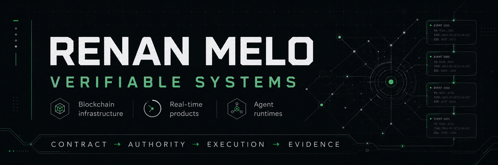
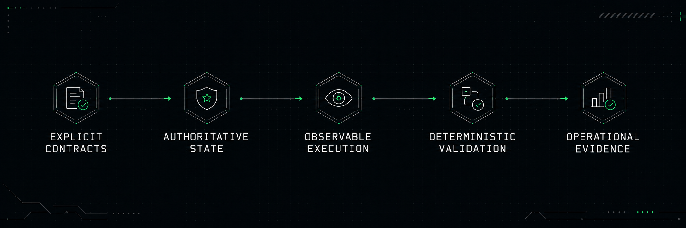
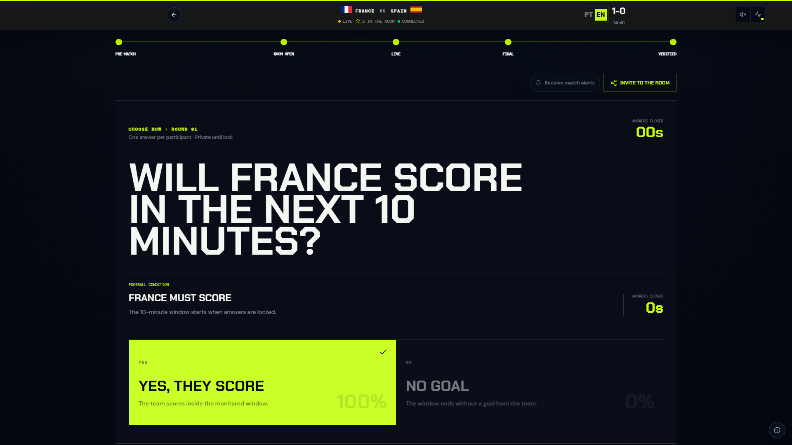
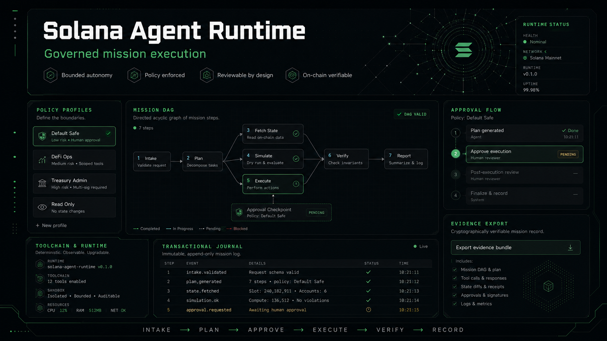

<picture>
  <source media="(prefers-color-scheme: dark)" srcset="./assets/profile-banner-dark.png">
  <source media="(prefers-color-scheme: light)" srcset="./assets/profile-banner-light.png">
  
</picture>

# Renan Melo

### Blockchain & Agentic Systems Engineer

I build verifiable systems across blockchain infrastructure, 
real-time products and agent runtimes.

 

  

São Paulo, Brazil · Open to remote engineering and product collaboration

## System philosophy

<picture>
  <source media="(prefers-color-scheme: dark)" srcset="./assets/system-philosophy-dark.png">
  <source media="(prefers-color-scheme: light)" srcset="./assets/system-philosophy-light.png">
  
</picture>

## Flagship

<table>
  <tr>
    <td width="48%" valign="top">
      
    </td>
    <td width="52%" valign="top">
      <h2>VIRA</h2>
      
<code>ACTIVE — LIVE PUBLIC DEPLOYMENT</code>

      
Synchronized multiplayer football challenges resolved through authoritative match evidence.

      
<strong>Verified properties</strong>

      <ul>
        <li>Server-owned deadlines</li>
        <li>Private pre-lock answers</li>
        <li>Deterministic replay</li>
        <li>Hash-chained event ledger</li>
        <li>Live SSE projections</li>
      </ul>
      

        <a href="https://vira.snelabs.space/?lang=en">Live</a> ·
        <a href="https://github.com/4LFR3Dv1/VIRA-">Source</a> ·
        <a href="https://www.youtube.com/watch?v=LnOd2kWTiGA">Demo</a> ·
        <a href="https://vira.snelabs.space/public/playback">Playback</a>
      

    </td>
  </tr>
</table>

<strong>Architecture, evidence and current limitations</strong>

 

The browser never decides the deadline, result or ranking. The server admits private answers, locks each round, resolves against eligible TxLINE observations and rebuilds public projections from append-only history.

- The permanent playback uses a disclosed, sanitized captured TxLINE fixture.
- The current event store is intentionally single-writer.
- Solana commitment is asynchronous and does not control resolution.
- No external security audit or public license is claimed.

[Architecture](https://github.com/4LFR3Dv1/VIRA-/blob/main/docs/ARCHITECTURE.md) ·
[Integrity model](https://github.com/4LFR3Dv1/VIRA-/blob/main/docs/INTEGRITY_MODEL.md) ·
[Security](https://github.com/4LFR3Dv1/VIRA-/blob/main/docs/SECURITY.md) ·
[Evaluation guide](https://vira.snelabs.space/help?lang=en)

## Proof strip

<table>
  <tr>
    <td align="center" width="25%"><strong>● Live systems</strong> Public runtime probes</td>
    <td align="center" width="25%"><strong>✓ Deterministic replay</strong> State rebuilt from history</td>
    <td align="center" width="25%"><strong>✓ Passing CI gates</strong> Build, tests and verification</td>
    <td align="center" width="25%"><strong>△ On-chain evidence</strong> Scoped devnet commitments</td>
  </tr>
</table>

## Verification paths

| System | Runtime | Repository | Verification | Evidence |
| --- | --- | --- | --- | --- |
| **VIRA** | ● Live | [Source](https://github.com/4LFR3Dv1/VIRA-) | Tests + [CI](https://github.com/4LFR3Dv1/VIRA-/actions/workflows/verify.yml) | [Playback](https://vira.snelabs.space/public/playback) + [readiness](https://vira.snelabs.space/ready) |
| **Solana Agent** | ◐ Pre-alpha | [Source](https://github.com/4LFR3Dv1/Solana-Agent) | Tests + pinned-toolchain CI | Stable sanitized devnet pack pending |
| **Portfolio** | ● Live | [Source](https://github.com/4LFR3Dv1/Portfolio) | `npm run verify` + CI | [Evidence room](https://renan.snelabs.space) |
| **Anchor Counter** | ◐ Devnet artifact | [Source](https://github.com/4LFR3Dv1/Web3Experts-Solana-Zero-to-Hero-2-Deploy-Your-First-Anchor-Program) | Anchor test | Program + transaction links |

## Selected systems

<table>
  <tr>
    <td width="50%" valign="top">
      <h3><a href="https://github.com/4LFR3Dv1/Solana-Agent">Solana Agent Runtime</a></h3>
      
<code>ACTIVE — PRE-ALPHA</code>

      
Governed runtime for bounded Solana engineering missions.

      
<strong>Proof:</strong> contracts · policies · approvals · journal · CI

      
<a href="https://github.com/4LFR3Dv1/Solana-Agent">Repository</a> · <a href="https://github.com/4LFR3Dv1/Solana-Agent/tree/main/docs">Architecture</a> · <a href="https://github.com/4LFR3Dv1/Solana-Agent/actions">CI</a>

    </td>
    <td width="50%" valign="top">
      <h3><a href="https://github.com/4LFR3Dv1/Portfolio">Portfolio</a></h3>
      
<code>ACTIVE — LIVE PUBLIC DEPLOYMENT</code>

      
Bilingual evidence room for architecture, responsibility and public proof.

      
<strong>Proof:</strong> live cases · verification gate · CI

      
<a href="https://renan.snelabs.space">Live</a> · <a href="https://github.com/4LFR3Dv1/Portfolio">Repository</a> · <a href="https://renan.snelabs.space">Evidence room</a>

    </td>
  </tr>
  <tr>
    <td width="50%" valign="top">
      <h3><a href="https://github.com/4LFR3Dv1/Agentic-Engineering">Agentic Engineering</a></h3>
      
<code>PROPOSED — NOT YET BUILT</code>

      
Public grant package separating prior work, future deliverables and acceptance criteria.

      
<strong>Proof:</strong> scope · threat boundaries · workflow evidence

      
<a href="https://github.com/4LFR3Dv1/Agentic-Engineering">Application</a> · <a href="https://github.com/4LFR3Dv1/Agentic-Engineering/tree/main/docs">Documents</a>

    </td>
    <td width="50%" valign="top">
      <h3><a href="https://github.com/4LFR3Dv1/EditalSales">EditalSales</a></h3>
      
<code>EXPERIMENTAL — HARDENING</code>

      
Opportunity radar and CRM with ingestion, local fallbacks and optional AI enrichment.

      
<strong>Proof:</strong> reproducible build · persistence tests · CI

      
<a href="https://github.com/4LFR3Dv1/EditalSales">Repository</a> · <a href="https://github.com/4LFR3Dv1/EditalSales/actions">Verification</a>

    </td>
  </tr>
</table>

<strong>Solana Agent architecture visualization</strong>

 

This is a conceptual map of the governed runtime — not a screenshot of a released product interface.

## Engineering focus

<table>
  <tr>
    <td width="33%" valign="top"><h3>Authority</h3>
Server-owned state, explicit deadlines, serialized mutation and fail-closed decisions.
</td>
    <td width="33%" valign="top"><h3>Evidence</h3>
Append-only ledgers, deterministic replay, decision receipts and operational probes.
</td>
    <td width="33%" valign="top"><h3>Agents</h3>
Bounded tools, policy profiles, approvals, durable journals and human review.
</td>
  </tr>
  <tr>
    <td width="33%" valign="top"><h3>Financial systems</h3>
Self-custody boundaries, local-first execution and transaction-safety research.
</td>
    <td width="33%" valign="top"><h3>Real-time products</h3>
SSE, WebSockets, provider normalization and resilient projections.
</td>
    <td width="33%" valign="top"><h3>Security practice</h3>
Threat modeling, least authority, secret boundaries and residual-risk documentation.
</td>
  </tr>
</table>

## Technology

**Systems:** TypeScript, Go, Python, Node.js, FastAPI, gRPC, SQLite, PostgreSQL 
**Interfaces:** React, Electron, Vite, SSE and WebSockets 
**Blockchain:** Solana, Anchor, Bitcoin, Liquid and Lightning 
**Delivery:** Docker, GitHub Actions, Playwright, Vitest, pytest and deterministic test harnesses

## Contact

[Portfolio](https://renan.snelabs.space) ·
[LinkedIn](https://linkedin.com/in/renan-melo-connexions) ·
[Email](mailto:byrenanmelo@gmail.com)
